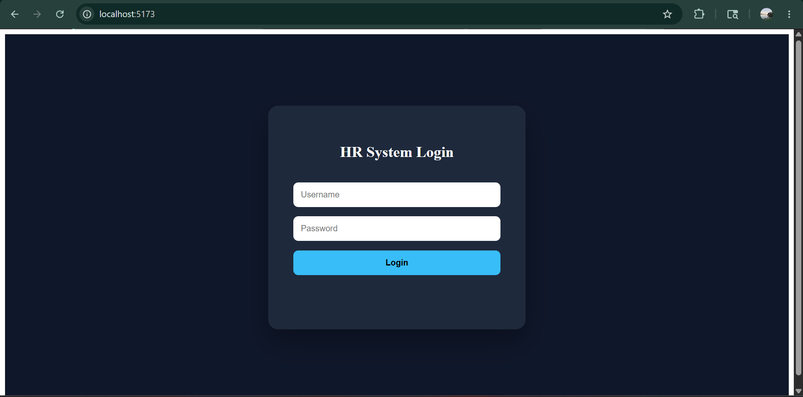
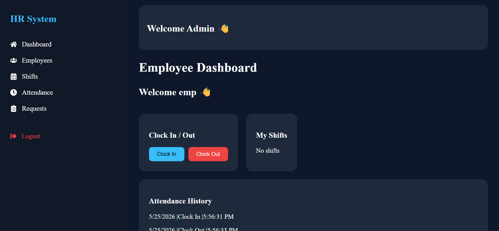

HR Management System

A **Full-Stack HR Management System** built using **React, Flask, SQLite, and REST APIs**.

This application provides **employee management, attendance tracking, shift scheduling, and role-based dashboards** for admins and employees.

---

# 📂 Project Structure

```bash
Clone of Workjam/
│
├── app.py                 # Flask Backend
├── hr.db                  # SQLite Database
│
├── frontend/
│   ├── public/            # Photos
│   │   └── demo.mp4       # Project Demo Video
│   │
│   ├── src/
│   │   ├── components/
│   │   │   ├── Layout.jsx
│   │   │   ├── Navbar.jsx
│   │   │   ├── Sidebar.jsx
│   │   │   └── StatCard.jsx
│   │   │
│   │   ├── pages/
│   │   │   ├── Login.jsx
│   │   │   ├── Admin.jsx
│   │   │   ├── Employee.jsx
│   │   │   ├── Employees.jsx
│   │   │   ├── Shifts.jsx
│   │   │   ├── Attendance.jsx
│   │   │   └── Requests.jsx
│   │   │
│   │   ├── App.jsx
│   │   └── main.jsx
│   │
│   ├── package.json
│   ├── package-lock.json
│   └── vite.config.js
│
└── README.md
```

---

## 📌 Features

### 🔐 Authentication
- Admin Login
- Employee Login
- Role-Based Authentication

### 👨‍💼 Admin Dashboard
- Premium SaaS Dashboard
- Employee Management
- Add Employees
- Delete Employees
- Shift Management
- Attendance Monitoring
- Sidebar Navigation

### 👷 Employee Dashboard
- View Assigned Shifts
- Clock In / Clock Out
- Attendance History
- Shift Change Requests

### 💾 Database
- SQLite Database Integration
- Persistent Data Storage
- Flask SQLAlchemy ORM

---

## 🛠️ Tech Stack

| Technology | Purpose |
|------------|---------|
| React.js | Frontend |
| Flask | Backend |
| SQLite | Database |
| SQLAlchemy | ORM |
| React Router | Navigation |
| Flask-CORS | API Communication |

---


## 📸 Project Preview

### 🏠 Homepage


### 👨‍💼 Employer Dashboard


### 🛠️ Admin Panel 1


### 🛠️ Admin Panel 2


## ⚙️ Installation & Setup


### Backend Setup

Install required Python packages:

```bash
pip install flask
pip install flask-cors
pip install flask-sqlalchemy
```

Run backend server:

```bash
python app.py
```

Backend runs on:

```text
http://127.0.0.1:5000
```

---

###  Frontend Setup

Go to frontend folder:

```bash
cd frontend
```

Install dependencies:

```bash
npm install
```

Run React frontend:

```bash
npm run dev
```

Frontend runs on:

```text
http://localhost:5173
```

---

## 🔥 Future Improvements

- Employee Edit Feature
- Analytics Dashboard
- AI Chatbot Integration
- Payroll System
- Email Notifications
- Dark / Light Theme

---

## 👨‍💻 Author

**Angad Singh**  
Applied Information Technology Student  
IT Support | Cybersecurity Enthusiast  
📍 Taupo, New Zealand

---

## ⭐ Support

If you found this project useful, consider giving it a **star ⭐ on GitHub**.
>>>>>>> cc309ac7bff1334bab5573bf2b19c9cb02d8749f
